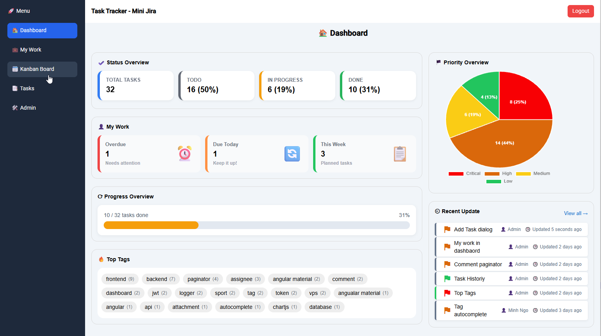
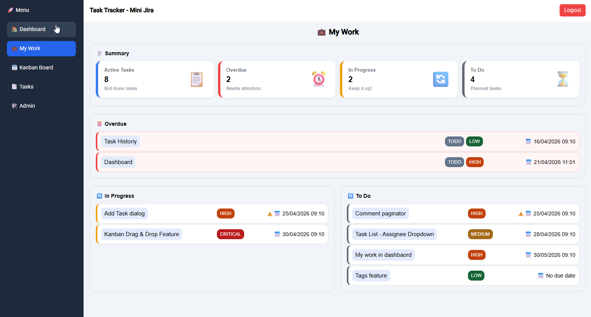
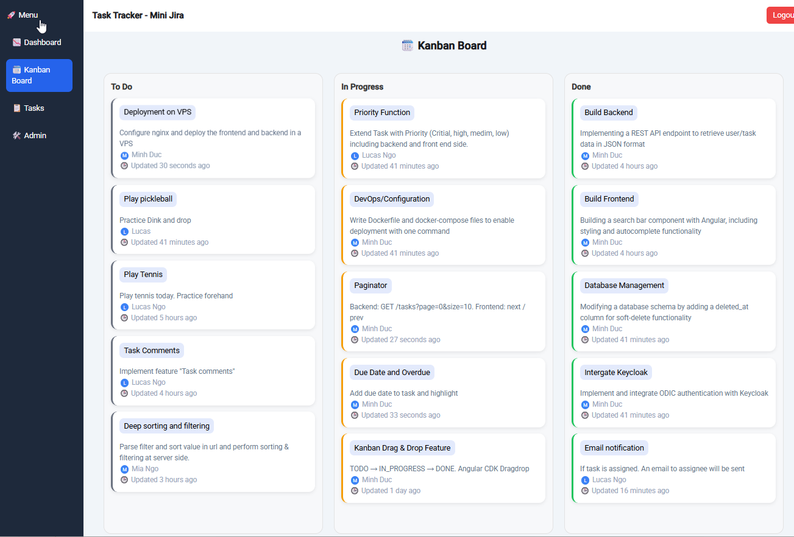
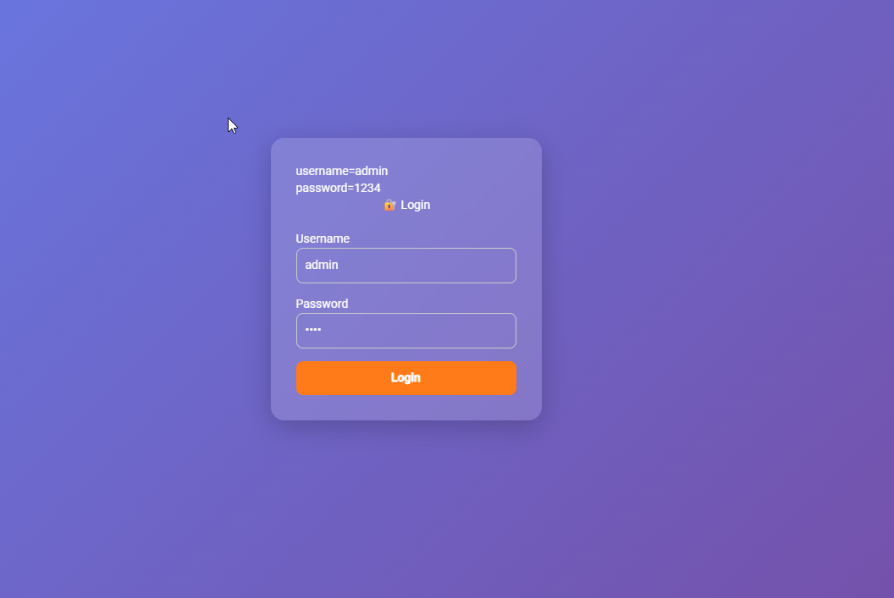
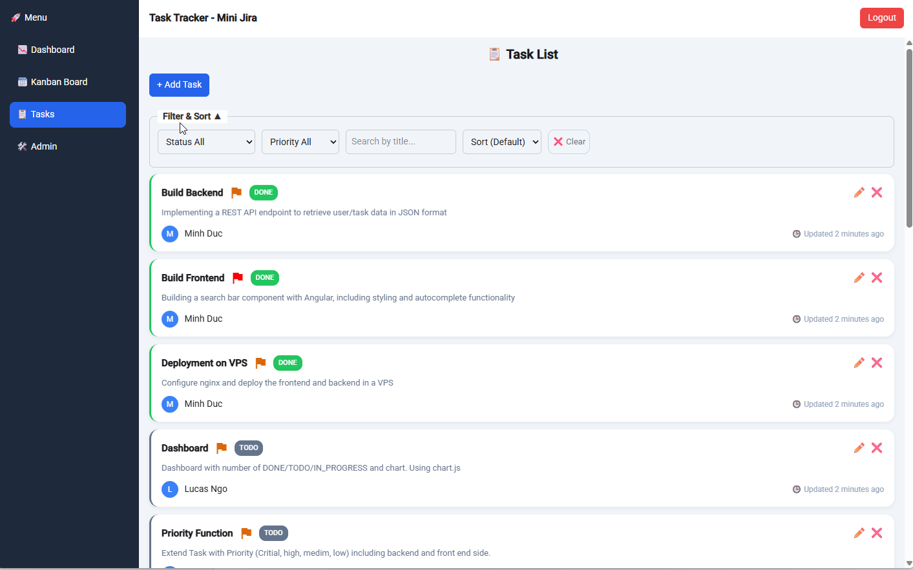
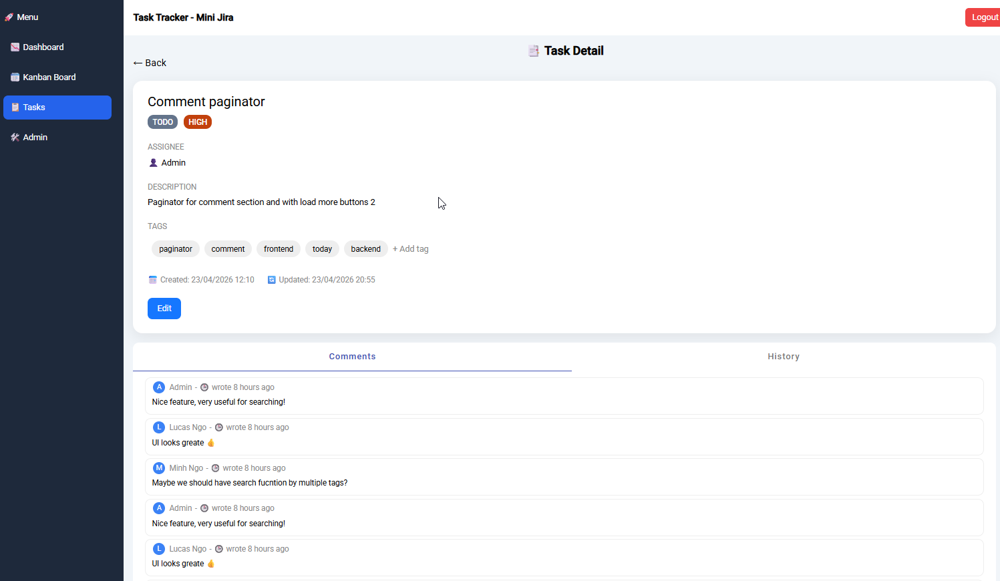
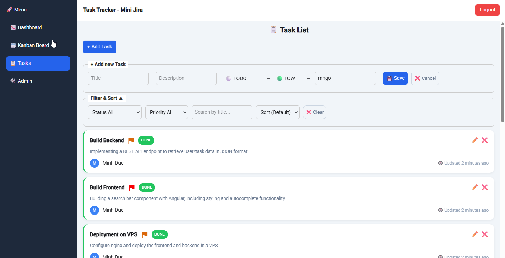
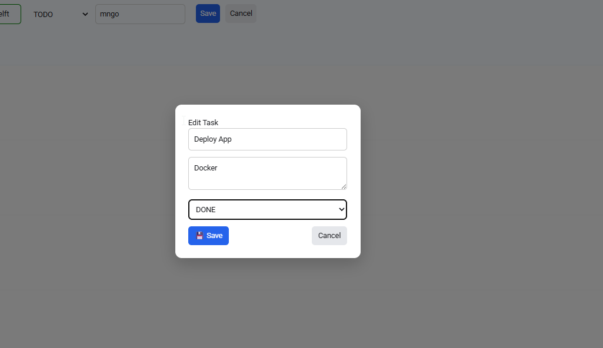
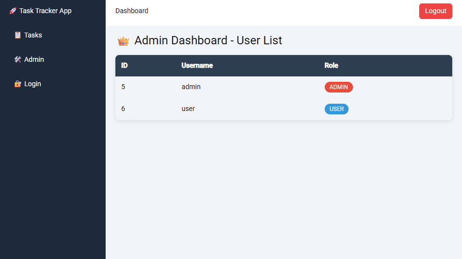

# 🚀 Task Tracker (Mini Jira)

A simple full-stack task management application inspired by Jira.  
Built with **Spring Boot + Angular**, focusing on clean architecture, JWT authentication, and modern frontend practices.

Live Demo: https://82.165.51.255/

<p align="center">
  
</p>

## ✨ Features

### 🔐 Authentication & Security
- 🔐 Authentication with JWT
- 🔄 Refresh token mechanism to renew access tokens
- 👤 Role-based access control (Admin & User)

### 📝 Task Management
- 📝 Task management (CRUD: Create, Read, Update, Delete)
- 👤 Assign tasks to users
- 📌 Status management: TODO, IN_PROGRESS, DONE
- 🚩 Priority levels: CRITICAL, HIGH, MEDIUM, LOW

### 🔍 Advanced Features
- 🔍 Advanced filtering, search & pagination
- 📊 Dashboard with statistics, charts & recent tasks
- 📋 Kanban Board with drag-and-drop (Angular CDK)

### 💬 Collaboration
- 💬 Task comments with pagination
- 🤝 Collaboration: discussions per task
- 📊 Task change history (audit log)
- 📝 Activity feed (timeline of changes)

### 📱 UI/UX
- 📱 Responsive UI with mobile-optimized layout (swipe / horizontal scroll)

### 🌐 Backend & API
- 🌐 Clean REST API design (Spring Boot best practices)
- 🧱 Layered architecture (Controller → Service → Repository)
- 🔄 DTO mapping & validation

### 📈 Logging & Observability (Production-Ready)
- 📈 Structured logging with correlationId for request tracing
- 🔗 Correlation ID propagation across requests
- 📥 Full HTTP request & response logging (method, URI, body, latency)
- 👤 User-aware logging (logs include authenticated user context)
- ⚠️ Standardized error logging with stacktrace & context
- 🧾 Audit logging for business actions (create/update/delete tasks)
- 📊 Activity tracking for debugging and system monitoring

### 🧪 Testing (Full-Stack Coverage)

#### 🧪 Backend testing (Spring Boot)
- Unit tests for service layer (business logic validation)
- Integration tests for REST controllers (MockMvc)
- Repository tests with in-memory database (H2)
- Validation & error handling test coverage

#### ⚡ Frontend testing (Angular + Vitest)
- Unit tests for components, services, and pipes
- Mocked HTTP requests for isolated testing- 
- Reactive forms & validation testing
- Observable-based async testing

#### 🌐 End-to-End (E2E) testing with Playwright
- Full user flow testing (login → dashboard → task actions)
- Authentication handling (JWT / session reuse)
- UI interaction testing (filters, navigation, pagination)
- Stable async handling (auto-wait, non-flaky tests)
- Multi-browser support (Chromium, Firefox, WebKit)

### 🐳 DevOps
- 🐳 Docker & Docker Compose setup for fullstack environment
- ⚙️ Environment-based configuration (dev/prod ready)

## ✨ To-do Features
- real time: sync kanban between users using websocket
- Offline-first: cache task and sync when it becomes online
- OIDC with keycloak (optional)
- File upload: save file local or in S3
- notification system :Notification {id, userId, message, isRead}. to trigger assign task, comment

## 🛠 Tech Stack

### Backend - TaskTracker (Spring Boot)

- Java 17+
- Spring Boot 3
- Spring Security + JWT
- Spring Data JPA
- PostgreSQL / H2
- Lombok

### Frontend - TaskTrackerFrontend (Angular)

- Angular 21
- RxJS (Observable, switchMap 🔥)
- Angular Material / Tailwind CSS
- HttpClient
- Angular Routing
- Authentication guard and admin guard

---

## 🏗 Architecture

### Backend Structure
```text
backend/
├── controller/    # REST controllers
├── service/       # Business logic
├── repository/    # Data access layer
├── dto/           # Data Transfer Objects
├── entity/        # JPA entities
├── security/      # JWT + Spring Security
└── config/        # App configurations
```

### Frontend Structure
```text
src/app/
 ├── core/
 │    ├── auth.service.ts
 │    ├── auth.interceptor.ts
 ├── features/
 │    ├── auth/
 │    │     └── login.component.ts
 │    ├── task/
 │          └── task.component.ts
 ├── models/
 └── app.routes.ts
```

### Frontend packages
### Chart
```
npm install chart.js
npm install chartjs-plugin-datalabels
```

### Angular Material
``` 
npm install @angular/material
ng add @angular/material
```
to use snackbar

style.css: @import '@angular/material/prebuilt-themes/indigo-pink.css';

### quill for tich text
```
npm install ngx-quill quill
```
style.css: @import 'quill/dist/quill.snow.css';
### Angular CDK for Drag & Drop
``` 
npm install @angular/cdk
``` 

### Angular ng-select
```
npm install @ng-select/ng-select
```

Angular.jss
```
"styles": [
  "src/material-theme.scss",
  "node_modules/@ng-select/ng-select/themes/material.theme.css",
  "src/styles.css"
]
```
###  toastr - not compatible for angular 21
```
npm install ngx-toastr
npm install @angular/animations
```

## 🛠 Testing with Postmann
TaskTracker.postman_collection.json

## 🗯️ Deployment on VPS

### 🚀 Deployment Steps
- [x] 🖥️ VPS setup  
- [x] ⚙️ Run backend (Spring Boot)  
- [x] 📦 Upload frontend (Angular)  
- [x] 🌐 Configure Nginx  
- [x] ✅ Test application 

### VPS setup
```
sudo apt update
sudo apt install openjdk-17-jdk nginx -y
```

### Install PostgreSQL
Install
```
sudo apt update
sudo apt upgrade -y
sudo apt install postgresql postgresql-contrib -y
```

Test Service:
```
sudo systemctl status postgresql
```
Create Database and user
```
Login: sudo -u postgres psql
Create db: CREATE DATABASE task_tracker;
Create User: CREATE USER app_user WITH PASSWORD 'Postgresql1234!';
```

Grant role:
```
ALTER ROLE app_user SET client_encoding TO 'utf8';
ALTER ROLE app_user SET default_transaction_isolation TO 'read committed';
ALTER ROLE app_user SET timezone TO 'UTC';
GRANT ALL ON SCHEMA public TO app_user;
ALTER SCHEMA public OWNER TO app_user;
GRANT ALL PRIVILEGES ON DATABASE task_tracker TO app_user;
```

Update application.properties
```
# PostgreSQL datasource
spring.datasource.url=jdbc:postgresql://localhost:5432/task_tracker
spring.datasource.driver-class-name=org.postgresql.Driver
spring.datasource.username=app_user
spring.datasource.password=Postgresql1234!
spring.jpa.database-platform=org.hibernate.dialect.PostgreSQLDialect
```

### Deploy backend to serser
```
scp target/TaskTracker.jar user@server:/home/user/
nohup java -jar tasktracker.jar > app.log 2>&1 &
``` 

Test:
```
curl http://localhost:8080/api/tasks
or curl http://localhost:8080/api/test
```


### Deploy Frontend to serser
Build & Copy
```
ng build --configuration production
scp -r dist/TaskTrackerFrontend/browser user@server:/var/www/TaskTracker
```

### Config Nginx
sudo nano /etc/nginx/sites-available/default

Content:
```
server {
    listen 80;
	server_name 89.165.51.255;
	
    root /var/www/app;
    index index.html;

    location / {
        try_files $uri $uri/ /index.html;
    }

    location /api/ {
        proxy_pass http://localhost:8080/api/;
        proxy_set_header Host $host;
        proxy_set_header X-Real-IP $remote_addr;
    }
}
```

Restart nginx:
```
nginx -t
sudo systemctl restart nginx
```

### Environment for dev & production
File: environments/environment.ts for dev branch
```
export const environment = {
  production: false,
  apiUrl: 'http://localhost:8080/api'
};
```

File: environments/environment.prod.ts for dev branch
```
export const environment = {
  production: false,
  apiUrl: '/api'
};
```

Extend: angular.json
```
"production": {
    "fileReplacements": [
        {
            "replace": "src/environments/environment.ts",
            "with": "src/environments/environment.prod.ts"
        }
    ],
```

### Fake SSL and forward to http
Extend /etc/nginx/sites-available/default
```
server {
    listen 443 ssl;
    server_name 82.165.51.255;

    ssl_certificate /etc/nginx/self.crt;
    ssl_certificate_key /etc/nginx/self.key;

    return 301 http://$host$request_uri;
}
```

Create Self-Signed Cert
```
openssl req -x509 -nodes -days 365 \
-newkey rsa:2048 \
-keyout /etc/nginx/self.key \
-out /etc/nginx/self.crt
```

##  🛠️ Containerize with Docker Image
### 🧱Docker architecture
````
[ Angular (build) ] → Nginx (serve frontend)
[ Spring Boot ] → backend API
[ H2 ] → database
````

### 🚀 STEP 1: Dockerfile for backend (TaskTracker/Dockerfile)
```
FROM eclipse-temurin:17-jdk-jammy

WORKDIR /app

COPY target/*.jar app.jar

EXPOSE 8080

ENTRYPOINT [ "java", "-jar", "app.jar" ]
```

### 🚀 STEP 2: Dockerfile for Angular and Nginx (TaskTrackerFrontend/Dockerfile)
```
FROM node:20 as build

WORKDIR /app

# 🔥 Copy dependency
COPY package*.json ./

# 🔥 use ci to clean install matching platform
RUN npm ci

# copy source
COPY . .

# build
RUN npm run build

# -------- NGINX --------
FROM nginx:alpine

COPY --from=build /app/dist/TaskTrackerFrontend/browser/ /usr/share/nginx/html
COPY nginx.conf /etc/nginx/conf.d/default.conf
```

### 🚀 STEP 3: nginx.conf file
```
server {
    listen 80;

    location / {
        root /usr/share/nginx/html;
        index index.html;
        try_files $uri $uri/ /index.html;
    }

    location /api/ {
        proxy_pass http://backend:8080/api/;
        proxy_set_header Host $host;
        proxy_set_header X-Real-IP $remote_addr;
    }
}
```

### 🚀 STEP 4: docker-compose.yml file
```
version: '3.8'

services:

  backend:
    build: ./TaskTracker
    container_name: task-tracker-backend
    ports:
      - "8080:8080"

  frontend:
    build: ./TaskTrackerFrontend
    container_name: task-tracker-frontend
    ports:
      - "80:80"
    depends_on:
      - backend
```


### 🚀 STEP 5: run docker-compose.yml file
- start Docker Desktop
- run: docker-compose up --build

### 🚀 STEP 6: Run and Test
- start docker Image
- test: docker ps -> outpout: task-frontend   ...   0.0.0.0:80->80/tcp   task-backend    ...   0.0.0.0:8080->8080/tcp

### 🚀 STEP 7: build from Windows

👉 Windows: delete node_modules localhost and install
```
cd frontend
rmdir /s /q node_modules
del package-lock.json

npm install
```

👉 Windows: build form sratch
```
docker-compose down -v
docker system prune -a
docker-compose up --build
```

## 📸 Screenshots

### Dashboard


### My Work


### Kanban Board


### Login Page


### Task List


### Task Detail


### Create Task


### Edit


### Admin



## 👨‍💻 Author
Minh Duc Ngo

## 📄 License

This project is licensed under the MIT License - see the LICENSE file for details.